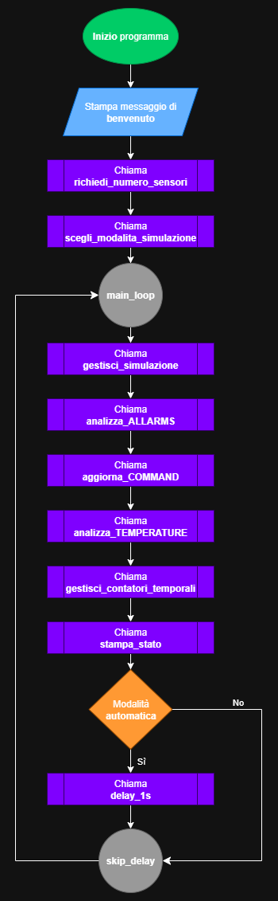
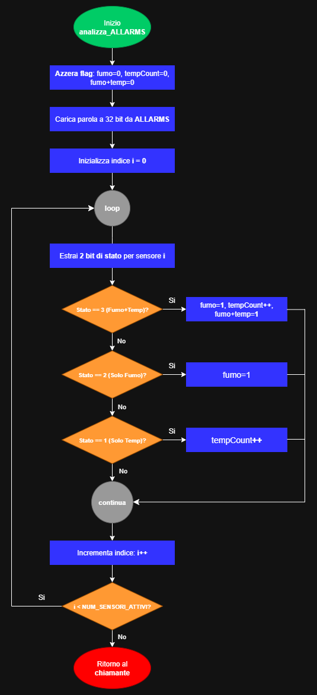
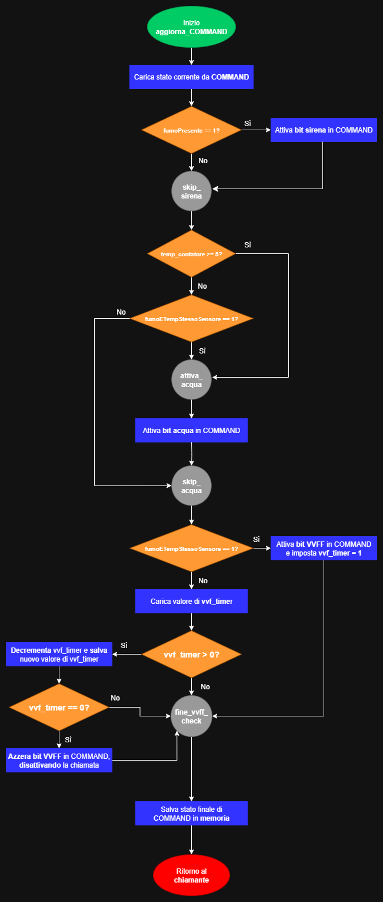
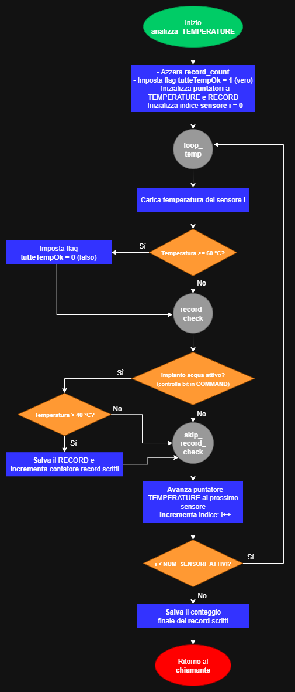
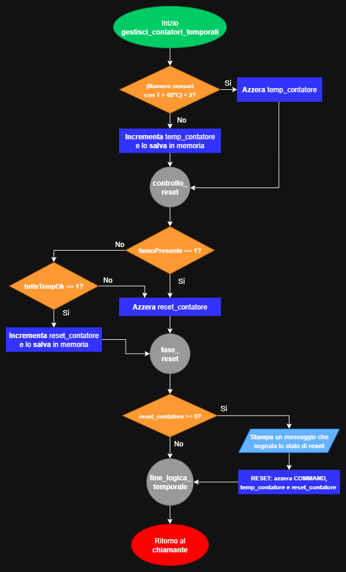

[](README-ENG.md)
[](README.md)

# MIPS Project: Fire Alarm System

**Author:** Richard Meoli
**Course:** "Calcolatori Elettronici", Università degli Studi di Bergamo
**Academic Year:** 2024/25

---

## Flowchart

This section presents the flowcharts illustrating the operational logic of the system’s main subroutines.

**Legend of symbols:**

- **Oval (Green/Red):** start / end of the subroutine.
- **Rectangle (Blue):** operation or internal process.
- **Diamond (Orange):** flow bifurcation (decision).
- **Double-bar Rectangle (Purple):** call to a subroutine.
- **Parallelogram (Light Blue):** input/output operations.
- **Circle (Gray):** flow connector (typically a `label` in the code).

### Subroutines included in the flowcharts:

- `main`: general diagram describing the program’s lifecycle, handling calls to all other functions in a continuous loop.
- `analizza_ALLARMS`: reads the ALLARMS status word and extracts, for each sensor, information about smoke presence and critical temperature.
- `aggiorna_COMMAND`: core logic for activating alarms (siren, water, fire department) based on detected states and system timers.
- `analizza_TEMPERATURE`: iterates over the TEMPERATURE memory area to determine if reset conditions are met and to record IDs of sensors with excessive temperature.
- `gestisci_contatori_temporali`: implements the system’s temporal logic, managing counters for the extinguishing system activation and general reset.

### Subroutines excluded from the flowcharts:

These subroutines were omitted because they are particularly repetitive and/or linear, or pertain exclusively to the simulation phase:

- `richiedi_numero_sensori` / `scegli_modalita_simulazione`: I/O functions managing initial user interaction; their logic is a simple sequence of “print message -> read input -> validate input.”
- `gestisci_simulazione` / `simulazione_automatica` / `simulazione_manuale`: populate the ALLARMS and TEMPERATURE areas with test data. Their logic is a repetitive read/write loop.
- `stampa_stato`: utility subroutine that reads values from memory and prints them formatted. Its flow is a long linear sequence of print operations.
- `delay_1s`: wait subroutine whose logic consists of a simple decrement loop.
- `exception_handler`: exception handler characterized by a very simple flow (read registers -> ignore interrupts -> print -> infinite loop).

---

### main


### analizza_ALLARMS


### aggiorna_COMMAND


### analizza_TEMPERATURE


### gestisci_contatori_temporali


---

## Most Relevant Code Snippets

### 1) Delay calibration via clock cycle calculation

To suspend program execution for approximately one second, an active busy-wait loop was implemented. Its duration is determined by a preset constant, `DELAY_COUNT`.

The value of this constant was derived from a theoretical analysis of execution time based on the processor’s specifications, then empirically calibrated to match the performance of the QtSPIM simulator.

```asm
delay_1s:
    lw $t0, DELAY_COUNT             # load the iteration count into $t0
delay_loop:
    addi $t0, $t0, -1               # decrement the iteration counter by 1
    bne $t0, $zero, delay_loop      # exit loop when iterations are complete
    jr $ra                          # return to caller
```

**Theoretical analysis and calibration**

The theoretical calculation is based on:

- **Processor frequency:** 100 MHz (100,000,000 clock cycles per second).
- **Loop composition:** the delay loop consists of two instructions: `addi` and `bne`.
- **Instruction costs (multicycle architecture):** `addi` takes 4 clock cycles, `bne` takes 3.
- **Total cost per iteration:** 4 + 3 = 7 clock cycles.

Thus, the theoretical number of iterations per second is: 100,000,000 cycles / 7 cycles per iteration ≈ 14,285,714 iterations.

However, the practical value for `DELAY_COUNT` was set to 10,000,000. This discrepancy compensates for QtSPIM’s overhead, which does not emulate cycle-accurate timing. Therefore, this calibrated value is specific to the test environment and may require further adjustment on other simulators or real hardware.

Note that setup instructions (`lw` and `jr`), being outside the loop, were excluded from this calculation, as their impact is negligible compared to millions of iterations.

### 2) Extracting 2 status bits for each of the 16 sensors

To isolate a specific sensor i’s data, a dynamic shift must be calculated. By multiplying the sensor index i by 2 (bits per sensor), we obtain the number of positions to shift the ALLARMS word to the right; we then use the `srlv` instruction, as the shift amount depends on register \$t2. Finally, an AND with mask 0x3 (0b11) isolates the two bits of interest.

```asm
# calculate shift to bring current sensor bits to the right
mul $t2, $t1, 2         # $t2 = i * 2 (2 bits per sensor)

# extract the 2 status bits for the current sensor
srlv $t3, $t0, $t2      # shift ALLARMS right by i * 2 positions
andi $t3, $t3, 0x3      # mask to isolate the two bits

# now $t3 holds the status value (0 to 3 in decimal)
```

### 3) Exception handler

An exception handler was implemented to catch any processor trap. It runs in kernel mode, saves the `Cause` and `EPC` registers (which contain the error code and the address of the failing instruction), prints a diagnostic message, and halts the system in an infinite loop (`safe_halt`) to prevent further damage. To test it, uncomment one of the two test instructions in the main (overflow or address error).

```asm
mfc0 $k0, $13           # copy Cause register into $k0
mfc0 $k1, $14           # copy EPC register (faulting instruction address) into $k1

sgt  $v0, $k0, 0x44     # distinguish exceptions from interrupts
bnez $v0, exit_handler  # if result is 1 (interrupt), ignore and exit handler

# exception detected: treat any unfiltered exception as fatal
andi $a0, $k0, 0x7C     # isolate ExcCode field (bits 2-6) from Cause
srl  $a0, $a0, 2        # shift right by 2 to get numeric exception code into $a0
move $a1, $k1           # pass EPC as second argument in $a1
```

```asm
safe_halt:
    j    safe_halt        # infinite loop to lock the system on fatal exception
```

The system is intentionally locked in a safe state upon exception to avoid undefined behavior and to preserve register and memory state for post-mortem analysis.

### 4) Disabling the fire brigade call

```asm
vvff_check_timer:
    # condition not met: check if call was active, and disable if so
    lb $t4, vvf_timer               # load timer into $t4
    beq $t4, $zero, fine_vvff_check # if timer is already zero, exit

    # timer > 0
    addi $t4, $t4, -1               # decrement timer by one second
    sb $t4, vvf_timer               # store updated timer
    
    # if timer has just reached zero, clear the VVFF bit; otherwise keep it active
    bne $t4, $zero, fine_vvff_check
    
    # timer reached zero: clear the bit
    not $t5, $t5                    # invert mask (from 00000100 to 11111011)
    and $t0, $t0, $t5               # AND to clear only the fire brigade bit

fine_vvff_check:
```

The fire brigade call must deactivate automatically after one second, regardless of other alarms. A dedicated timer variable (`vvf_timer`) is used: upon critical condition (smoke and high temperature on the same sensor), the bit is set and the timer initialized. In subsequent cycles, if the condition has cleared, the timer is decremented and, only when it reaches zero, the bit is turned off.

Note: this logic is generic—changing the impulse duration (e.g., to 3 seconds) only requires modifying the initial timer value, without altering the deactivation logic.