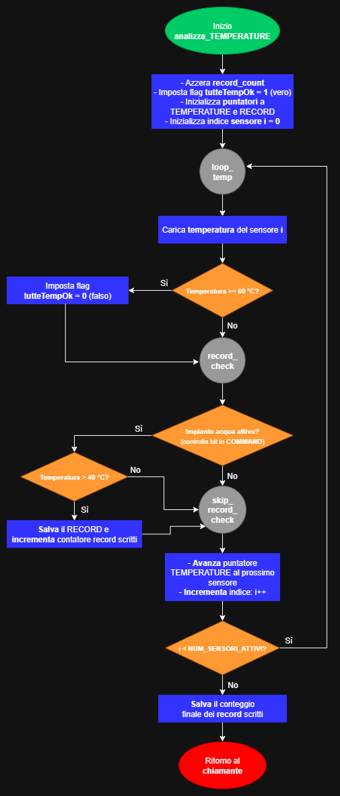

# Progetto MIPS: Allarme Anti-Incendio

**Autore:** Richard Meoli  
**Corso:** "Calcolatori Elettronici", Università degli Studi di Bergamo  
**Anno accademico:** 2024/25

---

## Flowchart

In questa sezione vengono presentati i diagrammi di flusso (flowchart) che illustrano la logica operativa delle subroutine principali del sistema.

**Legenda dei simboli:**
*   **Ovale (Verde/Rosso):** inizio / fine della subroutine.
*   **Rettangolo (Blu):** operazione o processo interno.
*   **Diamante (Arancione):** biforcazione del flusso (decisione).
*   **Rettangolo con doppia barra (Viola):** chiamata ad una subroutine.
*   **Parallelogramma (Azzurro):** operazioni di input/output.
*   **Cerchio (Grigio):** connettore di flusso (tipicamente una `label` nel codice).

### Subroutine incluse nei flowchart:
*   `main`: diagramma generale che descrive il ciclo di vita del programma, gestendo le chiamate a tutte le altre funzioni in un loop continuo.
*   `analizza_ALLARMS`: si occupa di leggere la parola di stato ALLARMS e di estrarre, per ogni sensore, le informazioni relative alla presenza di fumo e temperatura critica.
*   `aggiorna_COMMAND`: contiene la logica centrale per l'attivazione degli allarmi (sirena, acqua, VVFF) in base agli stati rilevati e ai timer di sistema.
*   `analizza_TEMPERATURE`: itera sull'area di memoria TEMPERATURE per determinare se le condizioni per il reset siano soddisfatte e per registrare gli ID dei sensori con temperatura eccessiva.
*   `gestisci_contatori_temporali`: implementa la logica temporale del sistema, gestendo i contatori per l'attivazione dell'impianto di estinzione e per il reset generale.

### Subroutine escluse dai flowchart:
Si è invece scelto di non realizzare i flowchart per le seguenti subroutine, caratterizzate dall'essere particolarmente ripetitive e/o lineari o dal riguardare esclusivamente la fase di simulazione.
*   `richiedi_numero_sensori` / `scegli_modalita_simulazione`: funzioni di I/O che gestiscono l'interazione iniziale con l'utente.
*   `gestisci_simulazione` / `simulazione_automatica` / `simulazione_manuale`: si occupano di popolare le aree di memoria con dati di test.
*   `stampa_stato`: subroutine di utility che si limita a leggere valori dalla memoria e a stamparli a schermo.
*   `delay_1s`: subroutine di attesa basata su un semplice ciclo di decremento.
*   `exception_handler`: gestore delle eccezioni con un flusso logico lineare (leggi registri -> ignora interrupts -> stampa -> loop infinito).

---

### main


### analizza_ALLARMS


### aggiorna_COMMAND


### analizza_TEMPERATURE


### gestisci_contatori_temporali


---

## Snippet di Codice Rilevanti

### 1. Calibrazione del Delay tramite Calcolo dei Cicli di Clock

Per sospendere l'esecuzione del programma per circa un secondo è stato implementato un ciclo di attesa attivo (busy-waiting). La durata di questo ciclo è determinata da una costante preimpostata, `DELAY_COUNT`. Il valore di tale costante è stato derivato da un'analisi teorica del tempo di esecuzione e successivamente calibrato empiricamente per adattarsi alle performance del simulatore QtSPIM.

```asm
delay_1s:
  lw $t0, DELAY_COUNT             # carico in $t0 il numero di iterazioni da effettuare
delay_loop:
  addi $t0, $t0, -1               # decremento di 1 il contatore delle iterazioni
  bne $t0, $zero, delay_loop      # esco dal ciclo terminate le iterazioni da compiere
  jr $ra                          # ritorno al chiamante
```

**Analisi teorica e calibrazione**

Il calcolo teorico si basa sui seguenti parametri:
*   **Frequenza del processore:** 100 MHz (100.000.000 cicli di clock al secondo).
*   **Composizione del loop:** `addi` e `bne`.
*   **Costo delle istruzioni (architettura multiciclo):** `addi` richiede 4 cicli, `bne` invece 3.
*   **Costo totale per iterazione:** 7 cicli di clock.

Il numero di iterazioni teoriche per un secondo è: 100.000.000 / 7 ≈ **14.285.714** iterazioni.

Il valore pratico per `DELAY_COUNT` è stato impostato a **10.000.000** per compensare l'overhead del simulatore QtSPIM. Questo valore calibrato è specifico per l'ambiente di test e potrebbe richiedere un'ulteriore ricalibrazione. Le istruzioni di setup (`lw` e `jr`) sono state escluse dal calcolo poiché il loro impatto è trascurabile.

### 2. Analisi dei 2 Bit di Stato per Ciascun Sensore

Per isolare i dati di un sensore specifico `i`, si calcola uno spostamento (shift) dinamico moltiplicando l'indice `i` per 2. Si utilizza l'istruzione `srlv` per far scorrere la parola `ALLARMS` di un numero di posizioni variabile. Infine, un'operazione di `AND` con una maschera (`0x3`) isola i due bit di interesse.

```asm
# calcolo lo scorrimento necessario per portare i bit del sensore corrente a destra
mul $t2, $t1, 2         # $t2 = i * 2 (dove 2 è il numero di bit per sensore)

# estraggo i 2 bit di stato del sensore corrente
srlv $t3, $t0, $t2      # scorro l'intera parola ALLARMS a destra di i * 2 posizioni
andi $t3, $t3, 0x3      # isolo i 2 bit di interesse con una maschera (0b11)

# ora $t3 contiene il valore di stato (da 0 a 3 in base 10)
```

### 3. Exception Handler

È stato implementato un gestore di eccezioni che intercetta i **trap** del processore. Viene eseguito in modalità kernel, legge i registri `Cause` ed `EPC`, stampa un messaggio di diagnostica e blocca il sistema in un **loop infinito (safe_halt)** per prevenire ulteriori danni. Per testarlo è sufficiente decommentare le istruzioni nell'apposito blocco di test nel `main`.

```asm
# Parte del gestore di eccezioni
mfc0 $k0, $13           # copio il registro "Cause" in $k0 per riportare la causa dell'eccezione
mfc0 $k1, $14           # copio il registro "EPC" in $k1, che contiene l'indirizzo dell'istruzione dove è avvenuta l'eccezione

sgt  $v0, $k0, 0x44     # distinguo le eccezioni dagli interrupt, verificano se $k0 (Cause) sia maggiore di 0x44
bnez $v0, exit_handler  # se il risultato è 1 (interrupt), lo ignoro e esco dal gestore

# eccezione rilevata: considero qualsiasi eccezione non filtrata come fatale
# preparo gli argomenti per la subroutine di gestione dell'errore
andi $a0, $k0, 0x7C     # isola il campo ExcCode (bit 2-6) dal registro Cause
srl  $a0, $a0, 2        # sposto a destra di 2 (per ottenere il valore numerico del codice di eccezione) e lo passo come primo argomento
move $a1, $k1           # passo l'indirizzo dell'errore (EPC) come secondo argomento ($a1)
```

Le pseudo-istruzioni `sgt` e `bnez` sono state utilizzate per **ignorare le interrupts** e intercettare **solamente le eccezioni (trap)**.

```asm
safe_halt:
  j    safe_halt
```

Si è deciso di porre il sistema in uno stato di **loop infinito** per "bloccarlo" in uno stato controllato di **guasto**, preservando lo stato dei registri e della memoria per la successiva analisi del problema, come si farebbe in un sistema reale.

### 4. Disattivazione della Chiamata ai VVFF

La chiamata ai VVFF si disattiva automaticamente dopo 1 secondo tramite un timer dedicato (`vvf_timer`). Quando la condizione critica si verifica, il bit dei VVFF viene attivato e il timer impostato a 1. Nei cicli successivi, il timer viene decrementato e solo quando raggiunge lo zero il bit viene disattivato. Questa logica rende il sistema **flessibile**, permettendo di modificare la durata dell'impulso senza alterare la logica di disattivazione.

```asm
vvff_check_timer:
  # condizione di chiamata NON verificata: controllo se la chiamata era già attiva e in tal caso la disattivo
  lb $t4, vvf_timer               # carico in $t4 il valore del timer
  beq $t4, $zero, fine_vvff_check # se timer già a 0 non c'era alcuna chiamata in corso, per cui esco

  # caso timer > 0
  addi $t4, $t4, -1               # decremento il timer di un secondo
  sb $t4, vvf_timer               # aggiorno il suo valore in memoria
    
  # se il timer è appena arrivato a 0, il bit VVFF deve essere spento;
  # altrimenti, la chiamata deve rimanere attiva per questo ciclo
  bne $t4, $zero, fine_vvff_check
    
  # timer è appena arrivato a 0, spengo il bit
  not $t5, $t5                    # inverto la maschera (da 00000100 a 11111011)
  and $t0, $t0, $t5               # uso un AND per azzerare solo il bit dei VVFF

fine_vvff_check:
```
